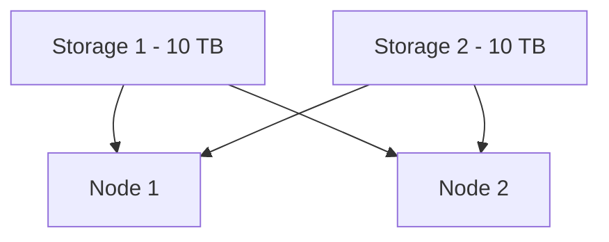
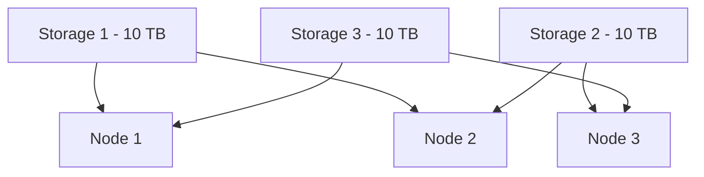
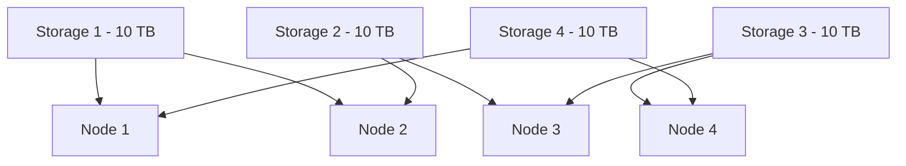

# StarWind Deployment Guide

# Customer Information Requirements

Before proceeding with configuration and deployment, gather the following information from the customer:

## General Networking

- [ ] Management subnet details (VLAN ID, Subnet, Gateway, DNS)
  
- [ ] Do you want to share the Management and VM traffic?
  
  - [ ] If no: Provide an additional subnet and IPs per node for VM traffic
    
  
- [ ] 4 Dedicated /24 subnets for:
  
  - [ ] Sync1
    
  - [ ] Sync2
    
  - [ ] Data1
    
  - [ ] Data2
    
  

## Host Information

- [ ] Hostnames for each host in the cluster
  
- [ ] 1 x IP per node for Windows OS on Management Subnet
  
- [ ] 1 x IP per node for Out-of-Band Management (OOBM)
  
- [ ] Cluster name
  
- [ ] 1 x IP for cluster MGMT on Management Subnet
  

## Example Information

- Cluster Information: **SW-Cluster01.internal.example.com —> 10.0.200.20**
- Share Host and VM traffic? **Yes**
- Default gateway: 10.0.200.1
- Subnet mask: 255.255.255.0
- DNS 1: 10.0.200.5
- DNS 2: 10.0.200.6

| Host | Name | MGMT | OOBM | Sync1 | Sync2 | Data1 | Data2 |
| --- | --- | --- | --- | --- | --- | --- | --- |
| H1  | SW-H1 | 10.0.200.21 | 10.0.200.11 | 172.16.1.1 | 172.16.2.1 | 172.16.3.1 | 172.16.4.1 |
| H2  | SW-H2 | 10.0.200.22 | 10.0.200.12 | 172.16.1.2 | 172.16.2.2 | 172.16.3.2 | 172.16.4.2 |
| H3  | SW-H3 | 10.0.200.23 | 10.0.200.13 | 172.16.1.3 | 172.16.2.3 | 172.16.3.3 | 172.16.4.3 |

---

# Deployment Summary

This document outlines the deployment steps for an N-node StarWind Virtual SAN Cluster, including:

- Demo network setup
- Server prep
- Networking Configuration
- StarWind Installation and Setup
- Failover Cluster configuration
- Testing and Configuration

---

# Deployment Guide

## Demo network setup

:::info
Use the switches, routers, and servers from the demo area.
:::

- Set up a gateway to mimic their MGMT network
- Set up a domain controller and DNS to match their environment (as much as possible)
    - The domain name needs to match theirs, so iSCSI targets and names are consistent
    - A cross-domain migration is still needed as one of the last pre-config steps.

## Server Prep

### Bios Settings

In the BIOS on each host, ensure each of the following settings is enabled/set:

- Virtualization extensions:
    - Intel VT
    - Intel VT-D (for directed I/O)
- Resume on AC power loss: `Power on`
- Set up Out-of-Band Management (OOBM) on the dedicated MGMT port
    - Assign an MGMT IP
    - The default username and password are already configured on ASUS systems.
- Ensure installed RAM, CPU, and Storage match the order

### Host Settings

Apply the following settings to each host, assuming this is Windows Server OS

- Assign hostname
- Set time zone

```powershell
Set-TimeZone -Name "Central Standard Time"
```

- Join the test domain
- Change power plan to **High Performance**
    - Control Panel > Power Options > Select `High Performance`
- Install required features

```powershell
$nodes = @("H1","H2","H3","H4") # Array of node names
$nodes.foreach({ Install-WindowsFeature -Name Failober-Clustering, Hyper-V, MultipathIO -IncludeManagementTools -ComputerName $_ })
```

- Enable multi-path IO

- GUI: Open MPIO > Discover Multipath > Check add support for iSCSI > add
- Powershell:

```powershell
Enable-MSDSMAutomaticClaim -BusType iSCSI

# Validate with ...
Get-MSDSMAutomaticClaimSettings
```

- Set load balancing policy for iSCSI connections This needs to be tested to see if this sets it on connections after changing the policy

```powershell
Set-MSDSMGlobalDefaultLoadBalancePolicy -Policy lqd
```

## Cluster Network Design

Reference the network diagrams in the following dropdowns for network configuration.

- Ensure that each host in the cluster is labeled consistently to avoid confusion.
- Each host will need a minimum of:
    - x6 25-gig ports SFP recommended
    - Additional ports are needed if the customer wants VM traffic separate from MGMT traffic.


<details>
<summary>**2-Node**</summary>

### 2-Node


</details>
<details>
<summary>**3-Node**</summary>

### 3-Node


</details>
<details>
<summary>**N-Node**</summary>

### N-Node


</details>

## Networking Configuration Inconsistent MGMT/LAN name

Configure the following networking settings on each node:

- Configure each of the nodes to have the following interfaces
    - LAN1, LAN2, Data1, Data2, Sync1, Sync2

- Name the adapters one at a time on each host
    
    ```powershell
    Rename-NetAdapter -Name "<Current Name>" -NewName "<New Name>"
    ```
    
- Create SET vSwitch for LAN\\MGMT interfaces
    
    - Create SET switch on the current host:
    
    ```powershell
    New-VMSwitch -Name "Lan (SET)" -NetAdapterName "LAN1,LAN2" -EnableEmbeddedTeaming $true
    ```
    
    - Create SET switch on all hosts:
        
        ```powershell
        $nodes = @("H1","H2","H3","H4") # Array of node names
        $nodes.foreach({New-VMSwitch -name "SET vSwitch" -NetAdapterName lan1,lan2 -EnableEmbeddedTeaming $true -ComputerName $_ })
        ```
        
    - If you need to share the vSwitch with the host OS, add:
        
        ```powershell
        -AllowManagementOS $true
        ```
        

- Disable DNS for Data and Sync interfaces
    - Data1, Data2, Sync1, Sync2
        - GUI: Interface Properties in Control Panel > IPv4 > Advanced > DNS > Uncheck the DNS box
        - PowerShell: **Review this**
            
            ```powershell
            get-netadapter | ?{$_.name -match "sync|data"} | foreach({ Set-DNSClient -interfaceAlias $_.Name -RegisterThisConnectionsAddress $False}) Set-DNSClient -InterfaceAlias sync1 -RegisterThisConnectionsAddress $False
            ```
            

- Set IP addresses on each interface.
- Enable jumbo frames on **all** interfaces

:::warning
Remove “vethernet|lan|“ if you do not want Jumbo frames on **Lan/MGMT** interfaces
:::

```powershell
get-netadapter | ?{$_.name -match "vethernet|lan|sync|data"} | foreach({ Set-NetAdapterAdvancedProperty -Name $_.Name -RegistryKeyword "*JumboPacket" -RegistryValue 9014})
```

- Set up RDMA
    - Enable the **File and Printer Sharing over SMBDirect (iWARP-in)** Firewall rule
        
        ```powershell
        Enable-NetFirewallRule FPSSMBD-iWARP-In-TCP
        ```
        
    - If MGMT and LAN are shared on a vSwitch or if the nic is on a vSwitch
        
        ```powershell
        Enable-NetAdapterRDMA -Name "Lan (SET)"
        ```
        
        - If they want to use the full bandwidth of the set team, add a 2nd nic
            
            ```powershell
            Rename-VMNetworkAdapter -ManagementOS -Name "Lan (SET)" -NewName "MGMT" 
            Add-VMNetworkAdapter -SwitchName "LAN (SET)" -Name "MGMT1" -ManagementOS 
            Enable-NetAdapterRDMA -Name "MGMT1"
            ```
            
        - Set vNIC affinity to a physical nic, so MGMT1 connects to MGMT1 every time. Prevents bottlenecking. [link](https://www.starwindsoftware.com/blog/forcing-the-affinity-of-a-vnic-to-a-pnic-with-a-set-vswitch/)
        - Run this for every vNIC on the vSwitch for live migration
            
            ```powershell
            Set-vmnetworkadapterteamingmapping -vmnetworkadaptername <VMNetworkAdapterName> -PhysicalNetworkAdapterName "LAN1" -ManagementOS
            ```
            

## StarWind Installation and Setup

### Prerequisites

1.  **Download StarWind**
    - Get it from the [StarWind website](https://www.starwindsoftware.com/).
    - You'll need to provide your contact information.
2.  **License Key**
    - Save the license key file to the server.
3.  **Create Storage Volume**
    - **Name:** `vSAN Storage`
    - **Drive Letter:** `S:\`
    - **File System:** NTFS
    - **Allocation Unit Size:** 8K (8192 bytes)
4.  **Disable Page File on Storage Volume**
    - Go to:  
        `Settings > System > About > Advanced System Settings`
    - Under **Performance**, click `Settings`
    - In **Performance Options**, go to the `Advanced` tab
    - Under **Virtual Memory**, click `Change`
    - Uncheck `Automatically manage paging file size for all drives`
    - For `C:\`:
        - Select `System managed size`
        - Click `Set`
    - For `S:\`:
        - Select `No paging file`
        - Click `Set`
    - Click `OK` and reboot if prompted.

---

### Install StarWind

1.  Run the installer
2.  Keep defaults until prompted for license
3.  Select **I have a key** and provide the license file
4.  Accept the EULA
5.  The installer will start the **iSCSI** service
6.  When prompted for **Configure SMI-S Provider**, click **No**
    
    > (SMI-S is like DNS for iSCSI—used for easier target discovery)
    

---

### Configure StarWind

On each host, configure the following settings:

- Enable iSCSI support for multiple networks
    - Stop the following services _(Everything that says StarWind)_
        - StarWind Cluster
        - StarWind SMI
        - StarWind Virtual SAN
            
            ```powershell
            Stop-Service -Name "StarWindService"
            ```
            
    - Navigate to `C:\program files\starwind software\starwind\starwind.cfg`
        - In the XML, set `iSCSIDiscoverListInterfaces` to `1`
        - Save
    - Restart StarWind services
        
        ```powershell
        Start-Service -Name "StarWindService"
        ```
        
- Open the StarWind management console and add all servers by **FQDN**
- Configure iSCSI access rights
    - Click on **host** \> **Access Rights** > **New Rule**
    - Name the rule `iSCSI Networks`
    - On the **source** and **destination** tab, leave it set to `all`
    - On the **interfaces** tab, add the **Data1**, **Data2**, and **127.0.0.1** interfaces for that host.
    - Set the **iSCSI Network**s to `allow`
    - Set the default **DefaultAccessPolicyiSCSI** to `deny`

### Storage Layout

**Rules:**

- **Always use all available storage**
- Each storage device is replicated to 1 other node by default (more if the customer requests it)
- Storage is split into multiple 2-way mirrors (more if the customer requests it)

**2-Node Cluster Example:** (20 TB total → 2x 10 TB mirrors)

- Storage 1: on Node 1 & Node 2
- Storage 2: on Node 1 & Node 2



**3-Node Cluster Example:** (Each node has 20 TB → 3x 10 TB mirrors)

- Storage 1: Node 1 ↔ Node 2
- Storage 2: Node 2 ↔ Node 3
- Storage 3: Node 3 ↔ Node 1



**4-Node Cluster Example:** (Each node has 20 TB → 4x 10 TB mirrors)

- S1: Node 1 ↔ Node 2
- S2: Node 2 ↔ Node 3
- S3: Node 3 ↔ Node 4
- S4: Node 4 ↔ Node 1



### Configure Storage Devices

After having a conversation with the customer on what they would like to do for replication, configure storage devices in the **StarWind Management Console**:

- Select the host you’d like to configure the storage device on.
- Click **Add Device (advanced)**
    - Select **Hard Disk Device**
    - **Virtual Disk**
        - Name: Storage&lt;x&gt;
        - **Size** (half of the available VM storage on host)
    - Use **4096** bytes sector size.
    - Numa Node: **auto**
    - **Write-Back**
    - **128 MB RAM Cache**
    - **No Flash Cache**
    - **Create new Target** (check target name looks good)
    - **Create storage device**
- Configure replication to a partner node
    - Select the storage device’s image file
    - Click on the **Replication Manager** tool
        - Add Replica
        - Synchronous “**Two-Way**“ Replication
        - Partner node name (**FQDN**)
            - FQDN ensures iSCSI target names are consistent across the cluster environment.
        - **Heartbeat**
        - Create a **new** partner device
        - Select location (**default location** is usually ok)
        - RAM Based Journal
        - Change network settings
            - For **Synchronization**, select **Sync1** and **Sync2**.
            - For **Heartbeat**, select **Data1**, **Data2**, and **MGMT**
            - Verify Networks look correct
            - Click **Do not synchronize** when creating a new device (nothing to synchronize)
                - This will immediately make the iSCSI target available for connection.
            - **Verify** initial sync was successful.
            - Repeat this for every storage device you need

### Connect iSCSI Targets

On each server, perform the following actions in the **iSCSI Initiator** application:

1.  Add target portals
    - in the **Discovery** tab, open the **Discover Portal**
    - Enter 127.0.0.1 in the Ip address field to discover all local iSCSI connections.
    - Enter all **Data1** and **Data2** IP addresses for **ALL OTHER NODES**
        
        :::success
        <details>
        <summary>Example of Target portals on H1 in a 2-node cluster</summary>
        
        | Network | Node | IP  |
        | --- | --- | --- |
        | Data1 | H1  | 172.16.21.5 |
        | Data2 | H1  | 172.16.22.5 |
        | Data1 | H2  | 172.16.21.6 |
        | Data2 | H2  | 172.16.22.6 |
        
        The Target portals on H1 should look like:
        
        
        
        </details>
        :::
        
2.  Connect to Discovered targets
    - In the **Targets** tab, click **Refresh** in the **Discovered targets** pane
    - Reading the IQN of the target … Connect to the target as follows
        - Connect local targets to **two** instances **127.0.0.1 test**
            
            :::success
            <details>
            <summary>Example of verifying local target connections</summary>
            
            
            
            </details>
            :::
            
        - Connect remote targets to the **Data1** interface and the **Data2** interface
            
            :::success
            <details>
            <summary>Example of verifying remote target connections</summary>
            
            
            
            </details>
            :::
            
    - Connect to **each target** in the **Discovered targets** pane
        - All Targets should say **connected** under **Status**
    - Ensure all storage devices appear in **disk management**

## Failover Cluster Configuration

## Testing and Configuration